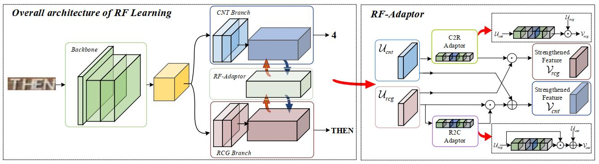

# 论文名称
[**Reciprocal Feature Learning via Explicit and
Implicit Tasks in Scene Text Recognition**](https://arxiv.org/abs/2105.06229.pdf)(ICDAR2021)

Hui Jiang, Yunlu Xu, Zhanzhan Cheng, Shiliang Pu, Yi Niu, Wenqi Ren, Fei Wu, and Wenming Tan
## 目录

```
1. 简介
2. 数据集和复现精度
3. 开始使用
4. 代码结构与详细说明
```


## 1. 简介




* 论文探究了文本识别过程中的隐式任务-字符计数 对文本识别任务的性能影响，创新性的提出了使用字符计数的方式辅助文本识别的训练，提高了文本识别的性能。网络的主体架构由四个部分组成：Backbone、CNTBranch、RCGBranch、RF-Adaptor,其中CNTBranch和RCGBranch分别负责字符计数和文本识别，RF-Adaptor则是将两者的特征进行交互，使得其中一个分支能够充分利用另一个分支的特征，相互提高。由于字符计数任务所需要的训练数据可以轻易地从已有的文本识别数据集中获取，因此不需要额外的标注信息。

* 本项目基于[PaddleOCR](https://github.com/PaddlePaddle/PaddleOCR)，参考了[DAVAR-OCR](https://github.com/hikopensource/DAVAR-Lab-OCR/tree/main/demo/text_recognition/rflearning)开源的PyTorch代码，提高了复现论文的效率。


* 本项目已经上传[AI Studio](https://aistudio.baidu.com/aistudio/clusterprojectdetail/4466529)， 可以直接训练测试。

## 2. 数据集和复现精度

* 训练集


    训练集为MJSynth和SynthText，具体可参考[MMOCR](https://mmocr.readthedocs.io/en/latest/datasets/recog.html#mjsynth-syn90k)


* 测试集

    |  数据集  | 数量 |      
    | :-------: | :-------------: | 
    |  IIIT5K   |      3000       | 
    |    SVT    |       647       |
    | IC03_860  |       860       |  
    | IC13_857  |       857       |
    | IC15_1811 |      1811       | 
    |   SVTP    |       645       |
    |  CUTE80   |       288       |
* 训练集和测试集可以从[此处下载](https://aistudio.baidu.com/aistudio/datasetdetail/166485)

* **复现精度**


<table>
    <tr>
        <td><strong><center>Methods</center></strong></td>
        <td colspan="4"><strong><center>Regular Text</center></strong></td>
        <td colspan="3"><strong><center>Irregular Text</center></strong></td> 
        <td colspan="2"><center><strong>Avg acc</center></strong></td>
    <tr>
	<tr>
        <td><center> Name </center></td>
        <td><center> IIIT5K </center></td>
        <td><center> SVT </center></td>
        <td><center> IC03 </center></td>
        <td><center> IC13 </center></td>
        <td><center> IC15 </center></td>
        <td><center> SVTP </center></td>
        <td><center>CUTE80</center></td>
        <td><center>Avg</center></td>
        <td><center>Config</center></td>
	<tr>
    <tr>
        <td><center> CNT(PyTorch)</center></td>
        <td><center> 96.5 </center></td>
        <td><center> 95.8 </center></td>
        <td><center> 96.9 </center></td>
        <td><center> 96.6 </center></td>
        <td><center> 89.7 </center></td>
        <td><center> 89.3 </center></td>
        <td><center> 91.0 </center></td>
        <td><center> 93.68 </center></td>
        <td><center> - </center></td>
	<tr>
    <tr>
        <td><center> CNT(Paddle)</center></td>
        <td><center> 96.0 </center></td>
        <td><center> 94.7 </center></td>
        <td><center> 96.2 </center></td>
        <td><center> 95.9 </center></td>
        <td><center> 88.7 </center></td>
        <td><center> 86.7 </center></td>
        <td><center> 88.2 </center></td>
        <td><center> 92.34 </center></td>
        <td><center><p><a href="configs/rec/rec_resnet_rfl_visual.yml"> Config </a></p></center></td>
	<tr>
    <tr>
        <td><center> Att(PyTorch) </center></td>
        <td><center> 94.5 </center></td>
        <td><center> 90.0 </center></td>
        <td><center> 94.0 </center></td>
        <td><center> 94.1 </center></td>
        <td><center> 81.5 </center></td>
        <td><center> 82.0 </center></td>
        <td><center> 84.7 </center></td>
        <td><center> 88.68 </center></td>
        <td><center> - </center></td>
	<tr>
    <tr>
        <td><center> Att(Paddle) </center></td>
        <td><center> 94.2 </center></td>
        <td><center> 89.5 </center></td>
        <td><center> 94.9 </center></td>
        <td><center> 94.2 </center></td>
        <td><center> 82.1 </center></td>
        <td><center> 83.9 </center></td>
        <td><center> 86.1 </center></td>
        <td><center> 89.27 </center></td>
        <td><center> <p><a href="configs/rec/rec_resnet_rfl_att.yml"> Config </a></p> </center></td>
	<tr>
<table>

**模型可以从[此处下载](https://pan.baidu.com/s/18WmNq2x6RjEB4d5g31T18A?pwd=xy5e)**

## 3. 开始使用

### 3.1 准备环境

- 框架：
  - PaddlePaddle==2.2

- 克隆本项目：

      git clone https://github.com/zhiminzhang0830/RFLearning_Paddle.git
      cd RFLearning_Paddle

- 安装第三方库：

      pip install -r requirements.txt


### 3.2 快速开始

  * **模型训练-CNT分支:**
    
        python3 -m paddle.distributed.launch --log_dir=./debug/ --gpus '0,1,2,3'  tools/train.py -c configs/rec/rec_resnet_rfl_visual.yml \
            -o Train.loader.batch_size_per_card=64 \
            Train.dataset.data_dir=./data/rfl_dataset2/training \
            Eval.dataset.data_dir=./data/rfl_dataset2/evaluation \
            Global.save_model_dir=./output/rec_resnet_rfl_visual/ 

  * **模型验证-CNT分支:**

        # IIIT5k(修改数据集路径，验证其他数据集)
        cfg_file=./output/rec_resnet_rfl_visual/config.yml
        model_file=./output/rec_resnet_rfl_visual/best_accuracy.pdparams
        data_dir=./data/rfl_dataset2/evaluation
        python3 tools/eval.py -c $cfg_file \
                    -o Global.pretrained_model=$model_file \
                    Eval.dataset.data_dir=$data_dir/IIIT5k_3000

  * **模型训练-Att分支:**(需要训练好的CNT分支作为预训练模型)
    
        python3 -m paddle.distributed.launch --log_dir=./debug/ --gpus '0,1,2,3'  tools/train.py -c configs/rec/rec_resnet_rfl_att.yml \
            -o Train.loader.batch_size_per_card=64 \
            Train.dataset.data_dir=./data/rfl_dataset2/training \
            Eval.dataset.data_dir=./data/rfl_dataset2/evaluation \
            Global.save_model_dir=./output/rec_resnet_rfl_att/ \
            Global.pretrained_model= your pretrained model

  * **模型验证-Att分支:**

        # IIIT5k(修改数据集路径，验证其他数据集)
        cfg_file=./output/rec_resnet_rfl_att/config.yml
        model_file=./output/rec_resnet_rfl_att/best_accuracy.pdparams
        data_dir=./data/rfl_dataset2/evaluation
        python3 tools/eval.py -c $cfg_file \
                    -o Global.pretrained_model=$model_file \
                    Eval.dataset.data_dir=$data_dir/IIIT5k_3000

  * **模型导出与推理:**

        # 导出模型
        python tools/export_model.py -c configs/rec/rec_resnet_rfl_att.yml \
                  -o Global.pretrained_model= ./output/rec_resnet_rfl_att/best_accuracy.pdparams \
                  Global.save_inference_dir=./output/rec_resnet_rfl_att/
        
        # 模型推理
        python3 tools/infer/predict_rec.py \
                 --image_dir="doc/imgs_words_en/word_10.png" \
                 --rec_model_dir=./output/rec_resnet_rfl_att/ \
                 --rec_image_shape="1, 32, 100" \
                 --rec_algorithm='RFL'


  * **TIPC:**(需要先安装[AutoLog](https://github.com/LDOUBLEV/AutoLog))
        
        bash test_tipc/prepare.sh test_tipc/configs/rec_resnet_rfl/train_infer_python.txt lite_train_lite_infer

        bash test_tipc/test_train_inference_python.sh test_tipc/configs/rec_resnet_rfl/train_infer_python.txt lite_train_lite_infer
    

## 4. 代码结构


    ├─configs
    ├─doc                        
    ├─output                           
    ├─ppocr      
    ├─tools                                            
    │  infer/                     
    │  eval.py                        
    │  export_model.py                        
    │  infer_cls.py                        
    │  infer_det.py                        
    │  infer_e2e.py                        
    │  infer_rec.py                        
    │  infer_table.py                        
    │  program.py                     
    │  test_hubserving.py                   
    │  train.py  
    ├─train.sh 
    ├─requirements.txt
    ├─setup.py 
    ├─README.md       


